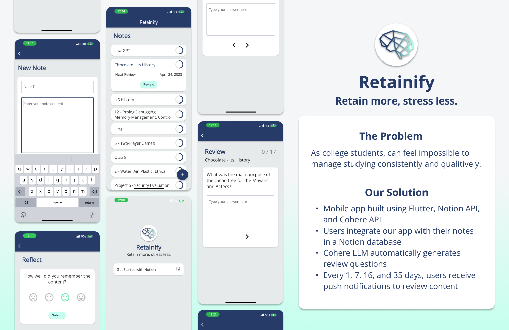

# Retainify
A Flutter mobile app built by [Alyssa Tadeo](https://github.com/ajtadeo), [Caleb Yang](https://github.com/SpiritualPanda), [Tyler Tran](https://github.com/tylerdtran), and [Alex West](https://github.com/awest25) for LA Hacks 2023.

## Why Retainify?
Everyone knows the pain of cumulative tests and quizzes 😫. Even if we mastered the content at some point, it's so easy to forget the specifics of a concept just days after learning it. It can feel impossible to manage studying previous notes consistently and qualitatively. That's why we built _Retainify_.

## Overview
_Retainify_ seamlessly integrates into your student workflow by taking your class notes and generating free-response review questions from them using one of Cohere's Artificial Intelligence Large Language Models 🧠. You even have the option of logging in with Notion and effortlessly accessing your own notes content through _Retainify_ 📓.

On the _Retainify_ dashboard, you can find a collection of your notes topics and see how much time you have until the next review session for each one. Once it's time for a review session, _Retainify_ will send you a push notification reminder, scientifically timed for long-term retention 🕖. In a review session, your content mastery will be put to the test, allowing you to reflect on your weaker areas and reminding you to continue studying your notes. Happy studying! 📚👩‍🏫  

## Technology Stack Utilized 
* Flutter
* Hive (local database)
* Notion API
* Cohere LLM API
